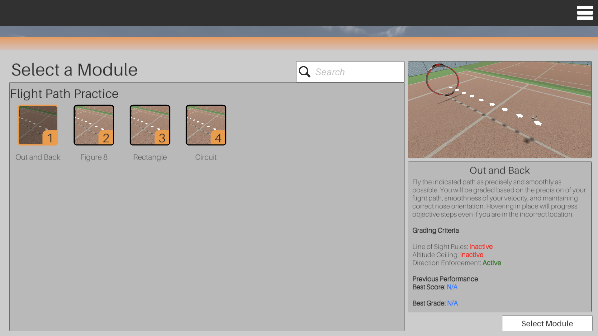

# Site License System Updates

June 9, 2025

## Overview

### What's changing?

The Site License system was a major improvement and heavily requested over our legacy licensing/seat system; however, it was created as a minimally viable product with the intention to expand and improve its functionality as time went on and feedback was given.

Changes overview:

1. For All Instructors and Institution Admins
   1. [Course Start and End Dates Require a Time](site-license-system-updates.md#course-start-and-end-dates-require-a-time)
   2. [Schedule Invites](site-license-system-updates.md#schedule-invites)
2. For Site License Organizations Only
   1. [Students licenses are tracked and managed separately from Instructor and Institution Admin licenses](site-license-system-updates.md#student-vs-instructor-vs-institution-admin-licenses)
   2. [Instructors Can Assign Licenses](site-license-system-updates.md#instructors-can-assign-license)
   3. [Site License Automatic Assignment (In Beta. Official Release Date TBD)](site-license-system-updates.md#site-license-automatic-assignment)

### **Why the change?**

Automatic site licensing assignment has been a heavily requested feature almost since the beginning of the site licensing system, and we've been working on the feature for a while. Quite frankly, it's long overdue. We appreciate all of our partners and users' patience and understanding while working within the current system. We hope this change reduces a lot of the confusion and legwork involved with simply getting your students access to the simulator.

Separating student vs instructor vs institution admin license pools is a necessary step towards our ultimate goal of this release: automatic license assignment.

### What do I have to do?

At the moment, nothing! Just familiarize yourself with the new Site License Manual Assignment updates here: [manual-assignment.md](../../../learning-management-system/site-license/manual-assignment.md "mention").

### When is this update happening?

The initial update that divides license pools by roles at an organization will release on **June 17, 2025.**

Site License Automatic Assignment will officially release once we finalize our Beta test. Release date TBD, so keep your ears open for another announcement when that's officially ready.

### How can I beta test?

Contact your Account Manager or sales@littlearms.com and tell them you are interested in testing the Site License Automatic Assignment system.

***

## **Details About the Changes**

### **Course Start and End Dates Require a Time**

Since we are scheduling automations on course dates, it's paramount that we get as exact as possible so that there's no confusion around when things are happening. For instance, if we are removing licenses from students at automatic site licensing organizations when their course ends, we know exactly when students can expect to lose access to the simulator.&#x20;

This also allows users to be explicit when creating a course and factoring in any time zone differences between the instructors and students of a course.

<figure><figcaption>
Create Course Window
</figcaption></figure>

### **Schedule Invites**

If you are **not** at a Site License (Automatic) organization, you can choose a send-date/time for your invitations!

<figure><figcaption>
Send Date Option for Student Invite
</figcaption></figure>

You can opt to send them immediately (like before) or pick "Choose a Date" where a date/time field will show up. You can select any date after today and on or before the course start date.

If you choose a future send date, you can still view your invites under your MANAGE > INVITES table. You can also see the "Send On Date" in the Status field.

<figure><figcaption>
Invites with Send Date
</figcaption></figure>

### **Student vs Instructor vs Institution Admin Licenses**

Currently, all site licenses are pooled and distributed together at an organization regardless of role. This was an initial flaw in our design since Student licenses are functionally different than Instructor/Institution Admin licenses at a site license organization.

This updated will separate those pools so that they can be managed independently - as they should have been from the start. This separation not only clarifies billing concerns, but also allows us to create the automatic assignment feature outlined below.

<figure><figcaption>
Site License Usage
</figcaption></figure>

### **Instructors Can Assign Licenses**

Initially, we were cautious about giving instructors the ability to assign and remove licenses from users; however, through testing and feedback it's clear that it would make instructors' lives much easier if they had the ability to assign licenses instead of reaching out to their institution admins. This is a small change that removes a very long step in the student licensing process.

### **Site License Automatic Assignment**


Official Release Date TBD. Private Beta Only


The biggest headache with the current system is the assigning and removing of licenses to users. For a new student, the process goes:

1. Instructor creates a course
2. Instructor invites student to a course
3. Student registers and accepts invite to a course
4. Instructor notifies Institution Admin that Student registered and accepted their invite and are ready for a license
5. Institution Admin assigns license to Student

That was entirely too many steps to simply assign a license to a student.

It has been heavily requested that a student simply gets a license assigned to their account when they accept the invite. It's been a very complicated journey to get here, but this feature will allow organizations to do just that.

Details about this change can be found here: [automatic-assignment.md](../../../learning-management-system/site-license/automatic-assignment.md "mention")

