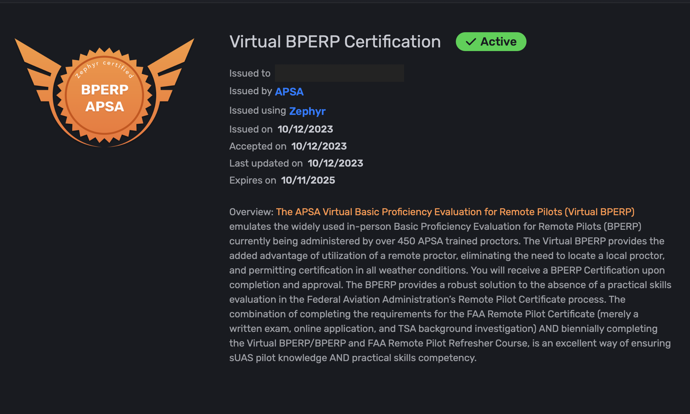

# Verify a Certification

PDF or printed certifications contain a QR code that you can scan using the camera app on your phone. &#x20;

The QR code is a verification link that will direct you to the Zephyr Sim website&#x20;

EX: https://zephyr-sim.com/verification/the-certification-id

<figure><figcaption></figcaption></figure>

Alternatively users can share there certification verification link from their Zephyr profile, or share their Zephyr Public Profile, or post their certification badges on their professional social media such as LinkedIn.

