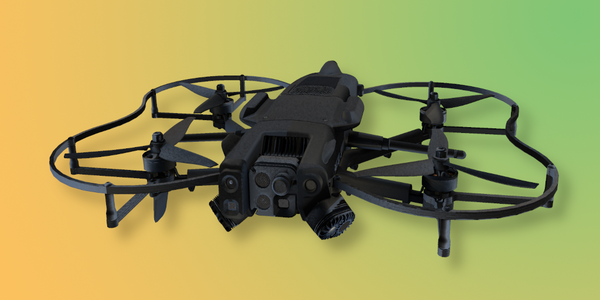

# Lemur 2

## Overview

<figure><figcaption></figcaption></figure>

## Specifications

### Aircraft

|                                 |                              |
| ------------------------------: | ---------------------------- |
|                       **Model** | Lemur 2                      |
|                **Manufacturer** | Brinc                        |
|                      **Copter** | Quadcopter                   |
| **Operating Temperature Range** | 4°F to 113°F / -20°C to 45°C |
|                   **Max Speed** | 48 mph                       |
|             **Max Flight Time** | 20 minutes                   |
|              **Max Perch Time** | 6 hours                      |
|                    **Released** | 2023                         |

### Gimbal

|                          |              |
| -----------------------: | ------------ |
|        **Stabilization** | 1-axis       |
| **Mechanical** **Range** | 190°(+/-95°) |
