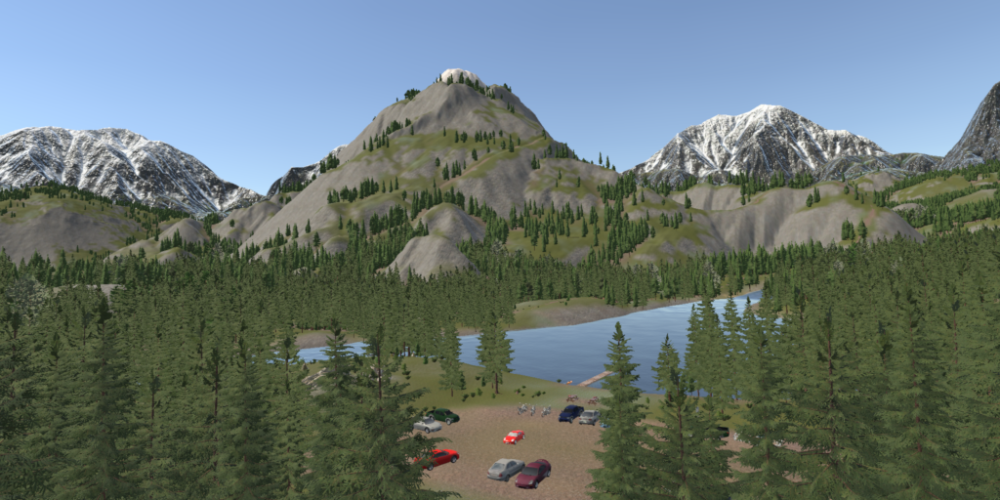

# Search and Rescue (SAR) Mountain

## Introduction

Search and Rescue Mountain Scenario. Test your SAR skills and trainings you've learned in SAR Fundamentals in a large open environment. Prepare for long flights meant to simulate real world SAR use cases.


Enterprise-only scenario. Not for Individual use


<figure><figcaption></figcaption></figure>

### Modules

* Free Flight
* Lost Camper 01
* Lost Camper 02
* Lost Camper 03
* Lost Child 01
* Lost Child 02
* Lost Child 03
* Lost Climber
* Lost Climbers
* Lost Hiker 01
* Lost Hiker 02
* Lost Hiker 03
* Missing Person - Day

### Module Breakdowns

#### Free Flight

(No description)

Drone Roster

* 3DR Solo
* AG-6A
* Alta X
* ANAFI USA
* Arrowhead
* Avata 2
* Bebop 2
* EVO II
* EVO Max 4T
* HD Racer
* Inspire 1
* Inspire 2
* Lemur 2
* Loki Mkii
* Matrice 200
* Matrice 30
* Mavic Pro
* Phantom 3
* Phantom 4
* Skydio 2
* Syma X5C
* Titan
* Typhoon
* X Star
* X10
* X2D

#### Lost Camper 01

A camper has gone missing and was last seen at the campsites by the parking lot and river. Go and search the surrounding areas and use SAR techniques to find the subject as quickly as possible.

Drone Roster

* 3DR Solo
* AG-6A
* Alta X
* ANAFI USA
* Arrowhead
* Avata 2
* Bebop 2
* EVO II
* EVO Max 4T
* HD Racer
* Inspire 1
* Inspire 2
* Lemur 2
* Loki Mkii
* Matrice 200
* Matrice 30
* Mavic Pro
* Phantom 3
* Phantom 4
* Skydio 2
* Syma X5C
* Titan
* Typhoon
* X Star
* X10
* X2D

#### Lost Camper 02

A camper has gone missing and was last seen at the campsite Northwest of the mountain in the valley Southwest of the pond. Go and search the surrounding areas and use SAR techniques to find the subject as quickly as possible.

Drone Roster

* 3DR Solo
* AG-6A
* Alta X
* ANAFI USA
* Arrowhead
* Avata 2
* Bebop 2
* EVO II
* EVO Max 4T
* HD Racer
* Inspire 1
* Inspire 2
* Lemur 2
* Loki Mkii
* Matrice 200
* Matrice 30
* Mavic Pro
* Phantom 3
* Phantom 4
* Skydio 2
* Syma X5C
* Titan
* Typhoon
* X Star
* X10
* X2D

#### Lost Camper 03

A camper has gone missing and was last seen at the campsite Southeast of the mountain on the far side of the connecting lakes. Go and search the surrounding areas and use SAR techniques to find the subject as quickly as possible.

Drone Roster

* 3DR Solo
* AG-6A
* Alta X
* ANAFI USA
* Arrowhead
* Avata 2
* Bebop 2
* EVO II
* EVO Max 4T
* HD Racer
* Inspire 1
* Inspire 2
* Lemur 2
* Loki Mkii
* Matrice 200
* Matrice 30
* Mavic Pro
* Phantom 3
* Phantom 4
* Skydio 2
* Syma X5C
* Titan
* Typhoon
* X Star
* X10
* X2D

#### Lost Child 01

A camper has gone missing and was last seen at the campsites by the parking lot and river. Go and search the surrounding areas and use SAR techniques to find the subject as quickly as possible.

Drone Roster

* 3DR Solo
* Alta X
* ANAFI USA
* Avata 2
* Bebop 2
* EVO II
* EVO Max 4T
* Inspire 1
* Inspire 2
* Lemur 2
* Matrice 200
* Matrice 30
* Mavic Pro
* Phantom 3
* Phantom 4
* Skydio 2
* Typhoon
* X Star
* X10
* X2D

#### Lost Child 02

A child has gone missing and was last seen across the river near the eastern base of the mountain. Go and search the surrounding areas and use SAR techniques to find the subject as quickly as possible.

Drone Roster

* 3DR Solo
* Alta X
* ANAFI USA
* Avata 2
* Bebop 2
* EVO II
* EVO Max 4T
* Inspire 1
* Inspire 2
* Lemur 2
* Matrice 200
* Matrice 30
* Mavic Pro
* Phantom 3
* Phantom 4
* Skydio 2
* Typhoon
* X Star
* X10
* X2D

#### Lost Child 03

A child has gone missing and was last seen near the mountaintop. Go and search the surrounding areas and use SAR techniques to find the subject as quickly as possible.

Drone Roster

* 3DR Solo
* Alta X
* ANAFI USA
* Avata 2
* Bebop 2
* EVO II
* EVO Max 4T
* Inspire 1
* Inspire 2
* Lemur 2
* Matrice 200
* Matrice 30
* Mavic Pro
* Phantom 3
* Phantom 4
* Skydio 2
* Typhoon
* X Star
* X10
* X2D

#### Lost Climber

A hiker has gone missing and was last seen climbing up the East side of the mountain. Go and search the surrounding areas and use SAR techniques to find the subject as quickly as possible.

Drone Roster

* 3DR Solo
* AG-6A
* Alta X
* ANAFI USA
* Arrowhead
* Avata 2
* Bebop 2
* EVO II
* EVO Max 4T
* HD Racer
* Inspire 1
* Inspire 2
* Lemur 2
* Loki Mkii
* Matrice 200
* Matrice 30
* Mavic Pro
* Phantom 3
* Phantom 4
* Skydio 2
* Syma X5C
* Titan
* Typhoon
* X Star
* X10
* X2D

#### Lost Climbers

Two climbers have gone missing and were last seen climbing up the West side of the mountain. Go and search the surrounding areas and use SAR techniques to find BOTH the subjects as quickly as possible.

Drone Roster

* 3DR Solo
* AG-6A
* Alta X
* ANAFI USA
* Arrowhead
* Avata 2
* Bebop 2
* EVO II
* EVO Max 4T
* HD Racer
* Inspire 1
* Inspire 2
* Lemur 2
* Loki Mkii
* Matrice 200
* Matrice 30
* Mavic Pro
* Phantom 3
* Phantom 4
* Skydio 2
* Syma X5C
* Titan
* Typhoon
* X Star
* X10
* X2D

#### Lost Hiker 01

A hiker has gone missing and was last seen on the trail across the river on the Northeast side of the mountain. Go and search the surrounding areas and use SAR techniques to find the subject as quickly as possible.

Drone Roster

* 3DR Solo
* AG-6A
* Alta X
* ANAFI USA
* Arrowhead
* Avata 2
* Bebop 2
* EVO II
* EVO Max 4T
* HD Racer
* Inspire 1
* Inspire 2
* Lemur 2
* Loki Mkii
* Matrice 200
* Matrice 30
* Mavic Pro
* Phantom 3
* Phantom 4
* Skydio 2
* Syma X5C
* Titan
* Typhoon
* X Star
* X10
* X2D

#### Lost Hiker 02

A hiker has gone missing and was last seen on the loop trail going up to the waterfall on the South side of the mountain. Go and search the surrounding areas and use SAR techniques to find the subject as quickly as possible.

Drone Roster

* 3DR Solo
* AG-6A
* Alta X
* ANAFI USA
* Arrowhead
* Avata 2
* Bebop 2
* EVO II
* EVO Max 4T
* HD Racer
* Inspire 1
* Inspire 2
* Lemur 2
* Loki Mkii
* Matrice 200
* Matrice 30
* Mavic Pro
* Phantom 3
* Phantom 4
* Skydio 2
* Syma X5C
* Titan
* Typhoon
* X Star
* X10
* X2D

#### Lost Hiker 03

A hiker has gone missing and was last seen on the trail going past the pond on the Northwest side of the mountain. Go and search the surrounding areas and use SAR techniques to find the subject as quickly as possible.

Drone Roster

* 3DR Solo
* AG-6A
* Alta X
* ANAFI USA
* Arrowhead
* Avata 2
* Bebop 2
* EVO II
* EVO Max 4T
* HD Racer
* Inspire 1
* Inspire 2
* Lemur 2
* Loki Mkii
* Matrice 200
* Matrice 30
* Mavic Pro
* Phantom 3
* Phantom 4
* Skydio 2
* Syma X5C
* Titan
* Typhoon
* X Star
* X10
* X2D

#### Missing Person - Day

A hiker has gone missing somewhere on the mountain. It is unclear what trails they took. Go and search the surrounding areas and use SAR techniques to find the subject as quickly as possible.

Drone Roster

* 3DR Solo
* AG-6A
* Alta X
* ANAFI USA
* Arrowhead
* Avata 2
* Bebop 2
* EVO II
* EVO Max 4T
* HD Racer
* Inspire 1
* Inspire 2
* Lemur 2
* Loki Mkii
* Matrice 200
* Matrice 30
* Mavic Pro
* Phantom 3
* Phantom 4
* Skydio 2
* Syma X5C
* Titan
* Typhoon
* X Star
* X10
* X2D

