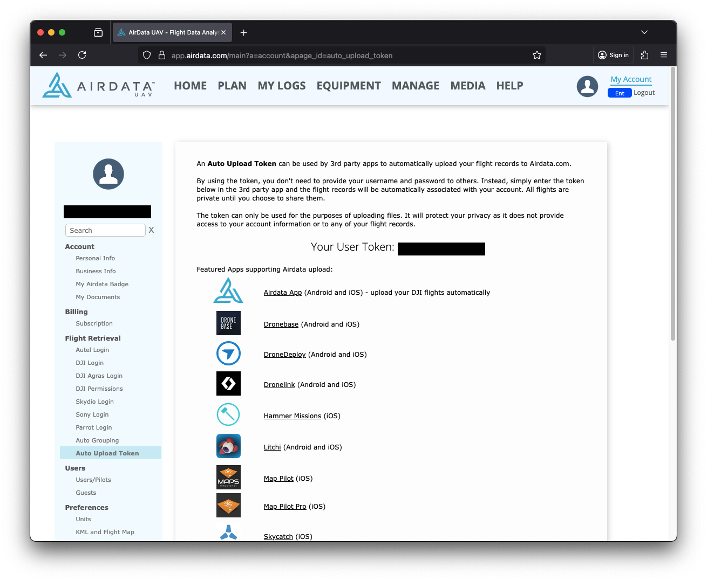

# AirData

## Link your AirData Account to Zephyr

### Upload Token

1. Login to your [airdata.com](https://airdata.com/) account
2. Click [Here](https://app.airdata.com/main?a=account\&apage_id=auto_upload_token) to go to the page with your Upload Token
3. Copy Your User Token

<figure><figcaption></figcaption></figure>

### Zephyr

1. Login to your [zephyr-sim.com](https://zephyr-sim.com/) account
2. Go to Settings
   1. Click your portrait on the left-hand menu
   2. Or click the “Settings Cog” in the nav bar
3. Click Linked Accounts
   1.  Click Link next to the AirData entry

       <figure><figcaption></figcaption></figure>
4.  Click Link

    <figure><figcaption></figcaption></figure>

5. Paste the Upload Token you copied earlier and click Link


If successful, your Zephyr and AirData accounts will now be linked. Every report that’s created will automatically be synced to your AirData account


## Unlink AirData Account 

1. Login to your Zephyr account at [zephyr-sim.com](https://zephyr-sim.com/login)
2. Click the User Settings option
   1. Click your portrait on the left-hand menu
   2. Or click the “Settings Cog” in the nav bar
3. Click "Linked Accounts"
4. Click the "Unlink" button next to the AirData entry


Your AirData account is now unlinked from your Zephyr account


## Sync Previous Zephyr Reports to AirData 

If you have older reports that were not synced to AirData before you linked your accounts, you can attempt to re-sync them

1. Login to your Zephyr account at [zephyr-sim.com](https://zephyr-sim.com/login)
2. Click on the “REPORTS” tab on the left-hand menu
3. If your AirData account is linked, you will see a “Sync AirData” button available at the top of the reports table


Reports created before 11/26/2020 cannot be synced to AirData. Depending on the number of syncable reports, this process can take up to a few minutes to finish. You will receive an email when the sync process finishes. At that time you can refresh the reports page or log back in to verify your reports have been synced.

